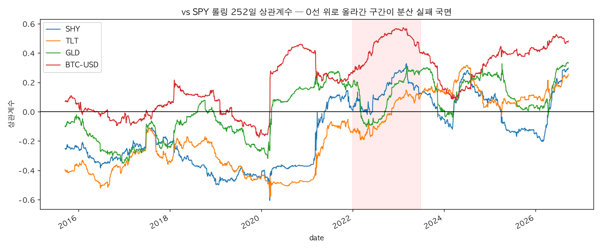

# 60/40은 아직 유효한가

2004–2026 미국주식·단기채·장기채·금·비트코인의 상관관계 국면 분석.
"주식 60 / 채권 40"의 전제(주식·채권 음의 상관)가 2022년에 깨진 이후, 그 전제가 국면 의존적임을 데이터로 점검하고 60/40의 수정 방안을 제안한다.

## 실행 방법

```bash
python -m venv .venv && source .venv/bin/activate
pip install -r requirements.txt
python src/fetch_data.py        # 캐시가 있으면 생략 가능
jupyter notebook notebooks/analysis.ipynb   # 셀을 위에서부터 순서대로 실행
streamlit run app.py            # 보너스 대시보드
```

## 데이터 출처

- 가격: Yahoo Finance (yfinance), 수정종가 기준. 개인 연구 목적 사용, 재배포 주의.
- 거시: FRED, Federal Reserve Bank of St. Louis (public domain).
- `data/*.csv`는 재현성을 위한 캐시본이며 원 출처 이용약관을 따른다.

## 결과 요약

- 2022년 동반 하락의 범인은 채권 자산군이 아니라 **듀레이션**: TLT -31.2% vs SHY -3.9%.
- TLT–SPY 상관계수는 2022년 0선 위로 반전(+) → 금리 인상 진정 후 복귀(-). 국면 의존적.
- 비트코인은 위기 시 주식이 아닌 채권·금과 동반 하락. "디지털 금" 서사와 불일치.


