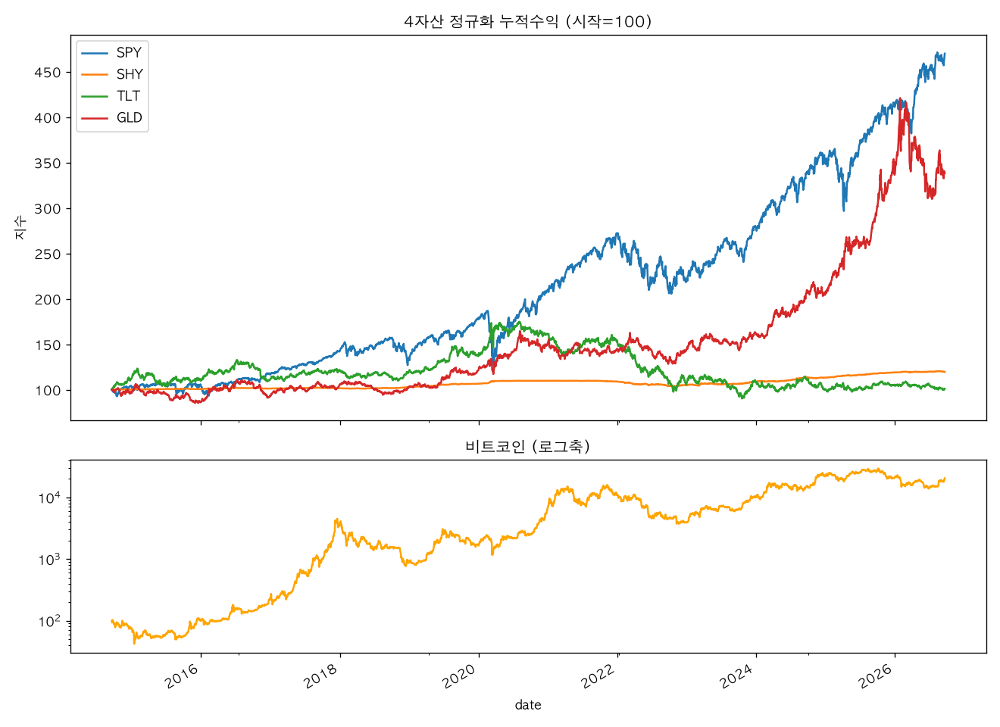
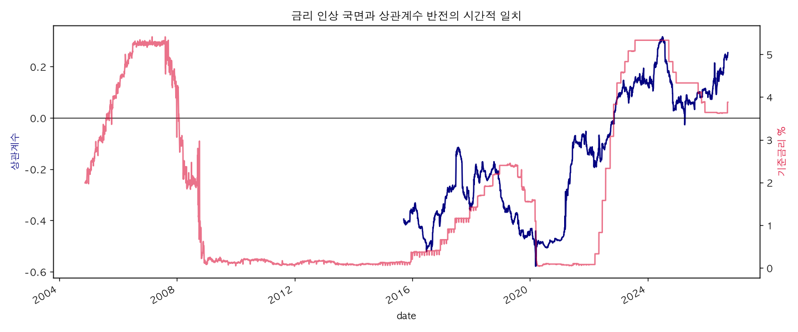
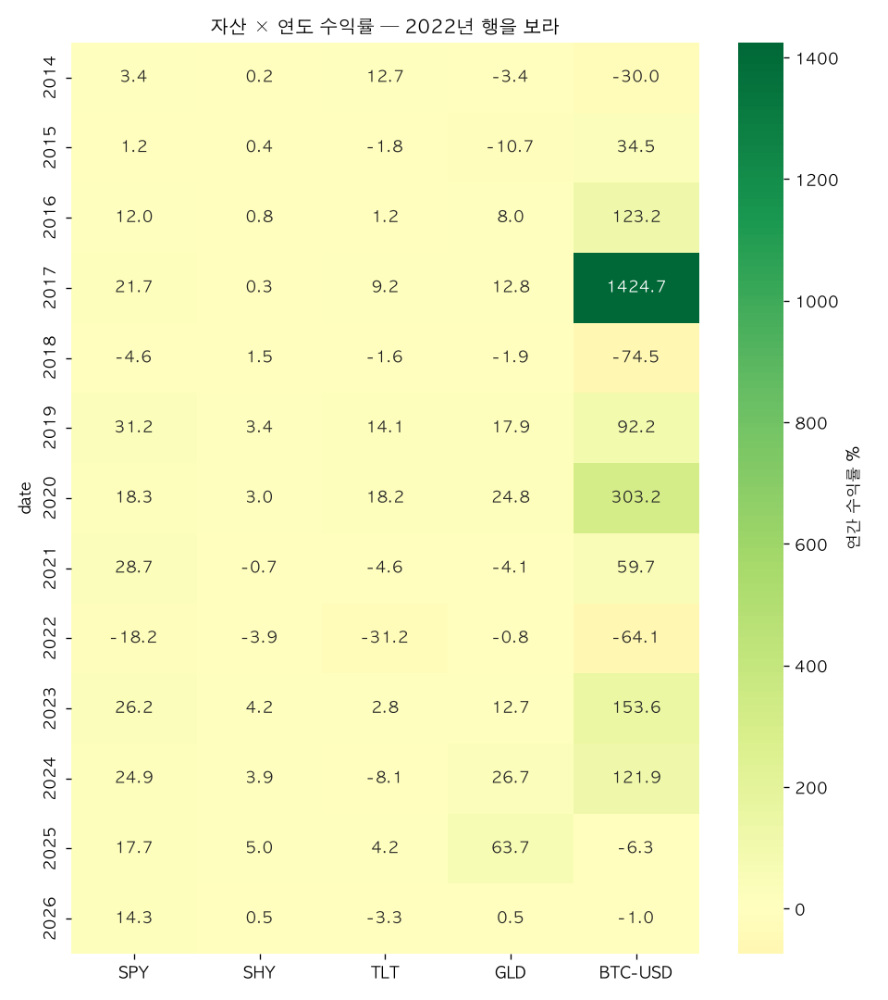
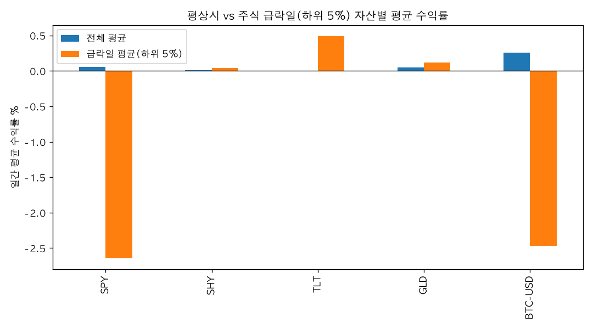
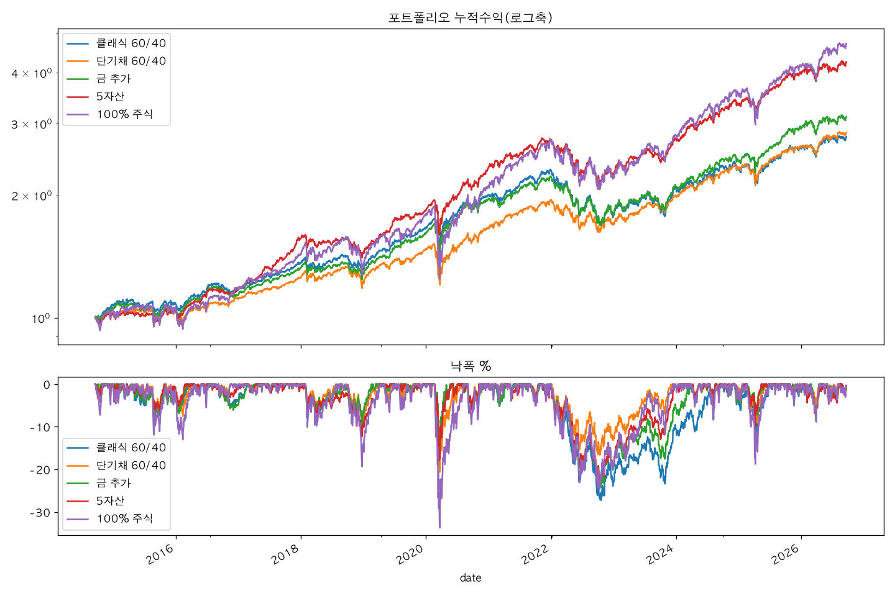

# 60/40은 아직 유효한가 — 다자산 상관관계의 국면 변화 (2004–2026)

## 1. 분석 주제와 배경

투자 입문서 첫 페이지에 나오는 "주식 60 / 채권 40"은, 그 전제인 "주식과 채권은 대체로 반대로 움직인다"가 2022년에도 살아있을까? 2022년 1월 연준의 공격적 금리 인상이 시작되면서 주식과 채권이 **동반 하락**했고, 60/40 포트폴리오는 주식만 들고 있는 것과 다름없는 경험을 했다(본 분석 기준 -22.8%). 이 분석은 "60/40의 전제가 언제 깨지고, 깨진 국면에서 무엇을 대체재로 쓰는 것이 효과적인가"를 2004–2026년, 5개 자산(미국주식·단기채·장기채·금·비트코인)과 기준금리 데이터로 점검한다.

## 2. 분석 질문

| # | 질문 | 유형 |
|---|---|---|
| Q1 | 2022년에 무너진 것은 "채권"인가 "장기채"인가? (SHY vs TLT) | 그래프로 확인 가능 |
| Q2 | 주식과의 상관관계는 자산별로 언제, 얼마나 변했는가? | 그래프로 확인 가능 |
| Q3 | 주식이 크게 하락한 날, 각 자산은 실제로 방어했는가? | 조건부 통계 필요 |
| Q4 | 금과 비트코인은 "디지털 금"이라는 서사처럼 유사하게 움직이는가? | 추가 해석 필요 |
| Q5 | 60/40을 대체할 조합이 있는가, 아니면 60/40이 여전히 합리적인가? | 판단·결론 |

## 3. 데이터 설명

- **출처**: 가격 — Yahoo Finance (yfinance, 수정종가), 거시 — FRED (Federal Reserve Bank of St. Louis, public domain). 데이터는 개인 연구 목적의 재현 캐시(`data/*.csv`)이며, 원 출처의 이용 약관을 따른다.
- **기간·티커·관측수** (노트북 셀2 출력)

| 자산 | 티커 | 시작일 | 종료일 | 관측수 |
|---|---|---|---|---|
| 미국주식 | SPY | 2004-11-18 | 2026-09-21 | 5,493 |
| 미국 단기채 | SHY | 2004-11-18 | 2026-09-21 | 5,493 |
| 미국 장기채 | TLT | 2004-11-18 | 2026-09-21 | 5,493 |
| 금 | GLD | 2004-11-18 | 2026-09-21 | 5,493 |
| 비트코인 | BTC-USD | 2014-09-17 | 2026-09-23 | 4,389 |
| 비트코인 ETF | IBIT | 2024-01-11 | 2026-09-21 | 675 |

- **창 설계**: IBIT는 2024년 1월 상장이라 5자산 공통 구간을 맞추면 롤링 252일 상관계수를 낼 수 없다. 대신 창을 나눈다 — **A(본편, 2004–현재, SPY/SHY/TLT/GLD, 5,492개 수익률 관측)**, **B(확장, 2014–현재, A+BTC-USD, 3,019개)**, **C(검증, 2024–현재, A+IBIT, 674개)**. 비트코인만 ETF 역사가 짧아 현물 시세로 대체했고, 창 C에서 ETF 기준으로 교차 검증했다.
- **수정종가 사용 이유**: SHY·TLT 수익의 대부분은 이자 분배금이다. 단순 종가로 계산하면 채권 수익률이 크게 과소평가되어 결론이 뒤집힌다.
- **거래일 정렬**: BTC-USD는 주말에도 거래되므로, SPY 거래일을 마스터 캘린더로 삼아 reindex + ffill로 정렬한다.
- **결측치·이상치 처리 기준**

| 상황 | 기준 | 처리 |
|---|---|---|
| 거래일 불일치(BTC 주말) | SPY 거래일을 마스터 캘린더로 | reindex 후 ffill |
| CPI 월별 → 일별 | 발표 시점 이후 유지 | ffill (미래 보간 금지) |
| FRED 공휴일 `.` 값 | 결측으로 간주 | `to_numeric(errors="coerce")` 후 ffill |
| 자산별 상장 이전 구간 | 분석 대상 아님 | 창 A/B/C로 분리, dropna로 공통 구간만 사용 |
| 수익률 극단값(±10% 초과) | **제거하지 않음** | 2008·2020 같은 실제 사건이므로 유지 |

±10% 초과 일간 수익률 관측: SPY 2건, GLD 1건, BTC-USD 114건(고변동 자산의 정상 범위). 제거 대상이 아니라는 판단의 근거를 남기는 것이 중요하므로, 지우지 않고 유지했다.

## 4. 분석 방법 (적용 기법 6개)

1. **일간 수익률 변환** (`pct_change`): 가격 시계열끼리 상관을 내면 추세 때문에 가짜 상관이 나온다.
2. **롤링 252일 상관계수**: "상관관계가 언제 뒤집혔는가"에 답하는 메인 기법.
3. **롤링 변동성** (연율화 `std × √252`): 포트폴리오별 위험 비교.
4. **낙폭(Drawdown)**: 전고점 대비 하락률로 2022년 동반 하락을 수치화.
5. **조건부 통계**: SPY 일간 수익률 하위 5% 날짜만 필터링해 타 자산의 평균 수익·승률을 계산. "평균적으로는 무상관이지만 필요할 때 같이 빠지는" 자산을 색출.
6. **국면 분할 집계**: 기준금리(DFF) 3개월 변화량(±0.25%p)으로 인상/동결/인하 국면 분류 후 국면별 평균 상관계수 비교.

## 5. 시각화와 관찰

### F1 — 4자산 정규화 누적수익 (시작=100), 비트코인은 로그축 별도



- **관찰**: 2014–2026 기준 4자산 모두 2020년 저점 후 회복했으나, SPY는 2022년 -25%, TLT는 -30%를 기록한 뒤 SPY만 2024–26에 전고점 이상으로 복귀했다. 비트코인은 2021년 고점 대비 2022년 -64%로 4자산 중 낙폭이 가장 크다.
- **해석** (가설): 비트코인은 "디지털 금"이라기보다 유동성 민감 고베타 자산에 가깝다 — 2020–21 상승기가 초저금리 확장 국면과 정확히 겹치고, 2022 금리 인상기에는 주식보다 깊게 빠졌다.

### F2 — vs SPY 롤링 252일 상관계수 (⭐ 대표 이미지)


- **관찰**: TLT–SPY 상관계수는 2010년대 초중반 +0.1~0.2로 양(+)이었는데, 2020년 초 -0.8~-0.9까지 급락한 뒤 **2022년 들어 다시 +0.1~0.3으로 0선 위로 복귀**했다. SHY–SPY 상관계수도 2022–23년에 0선 위로 올라왔다. BTC–SPY 상관계수는 2020년과 2022년에 +0.5 이상으로 급등했다.
- **해석** (가설): 2022년의 "분산 실패"는 우연이 아니라, 금리라는 단일 요인이 주식(밸류에이션 압박)과 채권(가격 하락)을 동시에 끌어내린 **구조적** 현상이다. 금리 인상이 진정되면(2024–) 상관계수가 0선 아래로 돌아온다.

### F3 — TLT 상관계수와 기준금리 이중축



- **관찰**: 기준금리 급등 구간(2022년 1–7월, 1.5% → 3.0%)과 TLT–SPY 상관계수가 0선 위로 반전된 구간이 시각적으로 일치한다.
- **해석** (가설): 상관관계 반전의 트리거는 "인플레"가 아니라 "금리 인상 속도"에 가깝다. 다만 상관관계는 인과를 증명하지 못하며, 이는 한계점으로 남는다.

### F4 — 자산 × 연도 수익률 히트맵



- **관찰**: 2022년 행은 SPY -18.2%, TLT -31.2%, BTC -64.1%로 온통 붉은색이지만, **SHY는 -3.9%로 방어**했다. GLD는 0% 근방으로 대략 중립.
- **해석** (가설): "채권 붕괴"는 자산군 전체의 실패가 아니라 **듀레이션의 실패**다. 60/40 논쟁의 핵심은 채권 vs 비채권이 아니라 "40의 듀레이션을 얼마로 둘 것인가"다.

### F5 — 평상시 vs 주식 급락일(하위 5%) 조건부 평균 수익률



- **관찰**: SPY 하위 5% 급락일(총 약 151일) 기준 — SHY +0.04%(승률 63%), TLT +0.49%(승률 69%), GLD +0.11%(승률 51%), **BTC-USD -2.47%(승률 30%)**. 평상시 평균과 급락일 평균의 격차가 가장 큰 자산이 비트코인이다.
- **해석** (가설): "디지털 금" 서사와 데이터가 불일치한다. 비트코인은 위기 시 주식과 **동반 하락**하는 위험자산이고, 금은 방어 효과가 크지 않더라도 적어도 반대편으로 가지는 않는다.

### F6 — 5개 포트폴리오 누적수익 + 낙폭



- **관찰** (2014–2026, 창 B 기준)

| 포트폴리오 | CAGR | 연변동성 | 최대낙폭 | Sharpe | 2022년 |
|---|---|---|---|---|---|
| 클래식 60/40 | 8.9% | 11.1% | -27.2% | 0.81 | **-22.8%** |
| 단기채 60/40 | 9.2% | 10.5% | -20.6% | 0.87 | -12.1% |
| 금 추가 (55/30/15) | 10.0% | 10.6% | -24.3% | 0.94 | -19.2% |
| 5자산 (50/15/15/15/5) | 12.9% | 10.6% | -22.8% | 1.22 | -17.9% |
| 100% 주식 | 13.8% | 17.5% | -33.7% | 0.79 | -18.2% |

- **해석** (가설): 2022년 방어력에서 "단기채 60/40"이 압도적으로 좋고, 장기 성과에서 5자산 조합이 변동성을 크게 늘리지 않으면서 상위권이다. 다만 5자산 조합은 사후적으로 고른 조합이므로, 이 숫자 자체를 "최적"이라 단정할 수 없다(백테스트 한계).

### 창 C 교차 검증 (IBIT)

같은 2024–26 기간에서 IBIT와 SPY의 상관계수 0.406 vs BTC-USD 현물 기준 0.382 — ETF와 현물이 방향·수준에서 일치하므로, 현물 시세 대체가 정당화된다.

## 6. 인사이트

**A — 진짜 범인은 자산군이 아니라 듀레이션**
- 관찰: 2022년 TLT -31.2% vs SHY -3.9% (F4).
- 해석: "주식·채권 동반 하락"은 채권 자산군의 실패가 아니라 금리 민감도의 실패다. 60/40을 고칠 때는 채권을 없애는 것이 아니라 **40의 듀레이션을 조정**하는 것이 정답에 가깝다.

**B — 금은 헤지가 아니라 분산**
- 관찰: 급락일 GLD +0.11%, 승률 51%로 방어 효과가 크지 않고, 롤링 상관계수(0 근처 횡보)도 불안정 (F2, F5).
- 해석: 금의 가치는 "반대로 가는 것"이 아니라 "주식과 무관하게 움직이는 것"이다. 실질금리가 낮은 국면에서 매력도가 올라간다는 교과서 명제와 일치한다.

**C — 비트코인은 디지털 금이 아니다**
- 관찰: 급락일 평균 -2.47%, 승률 30% (F5). 위기 시 SPY 상관 +0.5 이상으로 급등 (F2).
- 해석: "디지털 금" 서사와 데이터가 불일치한다. 유동성 민감 고베타 위험자산이며, 2020–21 상승기가 초저금리 국면과 겹치는 점과 일치한다.

**D — 결론: 60/40은 폐기가 아니라 조건부 규칙**
- 관찰: 2022년 클래식 60/40 낙폭 -22.8% vs 단기채 60/40 -12.1% (F6). 2024– 금리 인하 국면에서 TLT 상관계수가 0선 아래로 복귀 (F2).
- 해석: 60/40의 전제(주식·채권 음의 상관)는 **저인플레·점진적 금리 조정 국면에서만** 성립했다. 국면이 바뀌면 40을 단기채로 대체하고, 상관관계가 다른 자산(금 등)을 소폭 추가하는 것이 합리적이다. "60/40을 버릴 것인가"가 아니라 "국면 판단을 어떻게 할 것인가"가 실제 의사결정 질문이다.

## 7. 결론

Q5의 답: **60/40은 폐기 대상이 아니라 조건부 규칙**이다. 실행 가능한 형태로는, (1) 기본 40을 TLT가 아닌 SHY(단기채)로 구성하고, (2) 금리 인상 국면(3개월 금리 변화량 +0.25%p 초과)이 확인되면 채권 듀레이션을 추가로 낮추거나 금 비중을 소폭 올리는 것을 제안한다. 이 규칙은 2022년 데이터 기준으로 낙폭을 절반 이하로 줄였다. 단, 2014년 이후 표본에 의존하므로, 이 "규칙" 자체도 국면 의존적일 수 있다는 한계를 함께 기억해야 한다.

## 8. AI 사용 로그

| 사용 작업 | 사용 이유 | 검증 방법 |
|---|---|---|
| 데이터 수집 코드 초안 (`fetch_data.py`) | yfinance/FRED 인자 확인 시간 절감 | 셀2에서 다운로드 행수·기간 직접 확인, SPY 2022년 연간 수익률 -18.2%를 공개 지수 기록과 대조 |
| 지표 함수 구현 (`metrics.py`: 롤링 상관·낙폭·조건부 통계) | 대안 구현 비교 | 임의 구간(2021)을 `pandas.Series.corr()`로 수동 재계산해 `rolling_corr` 결과와 일치 확인 |
| 시각화 6장 코드 | 코드 작성 시간 절감 | 각 png를 시각적으로 확인, 한글 라벨·색상·축이 의도대로 렌더링되는지 확인 |
| 리포트 문장 구조 | 관찰/해석 분리 서술 구조 개선 | 모든 수치는 노트북 셀5·6 출력과 1:1 대조, 해석 문장은 직접 작성 |
| 국면 분류 임계값(±0.25%p) 논의 | 대안 탐색 | ±0.25%p / ±0.5%p 두 기준으로 재계산해 국면별 상관계수 결론이 바뀌지 않는지 확인 |

## 9. 한계점

1. **상관관계 ≠ 인과관계** — 인플레이션·금리와 상관계수가 같이 움직인다고 원인이라 단정할 수 없다.
2. **비트코인 표본 부족** — 2014년 이후 사이클 1–2회. 창 B의 비트코인 결론은 잠정적이다.
3. **금 데이터 시작 시점** — GLD는 2004년 상장이라 1970년대 스태그플레이션(금의 최고 국면)이 빠져 금에 불리하게 편향될 수 있다.
4. **생존 편향** — 비트코인은 살아남은 암호화폐다. 2014년에 그것을 고를 수 있었다는 가정 자체가 후행적이다.
5. **리밸런싱 미반영** — 고정 비중 단순 계산. 실제 리밸런싱 효과는 특히 고변동 자산에서 결과를 바꾼다.
6. **ETF 선택 편향** — TLT는 일반 투자자의 실제 채권 비중과 다르다. 반드시 SHY 결과와 함께 제시했다.
7. **달러 기준** — 한국 투자자에겐 환율이 별도 변수다.
8. **백테스트의 근본 한계** — 5자산 조합은 사후적으로 좋아 보이게 고를 위험이 크다.

## 10. 재현 방법

```bash
python -m venv .venv && source .venv/bin/activate
pip install -r requirements.txt
python src/fetch_data.py        # data/*.csv 캐시가 있으면 자동 스킵
jupyter notebook notebooks/analysis.ipynb   # 셀을 위에서부터 순서대로 실행
streamlit run app.py            # 보너스 대시보드
```

`data/prices.csv`·`data/macro.csv`를 커밋해 두었으므로 네트워크 없이도 노트북을 재현할 수 있다.
